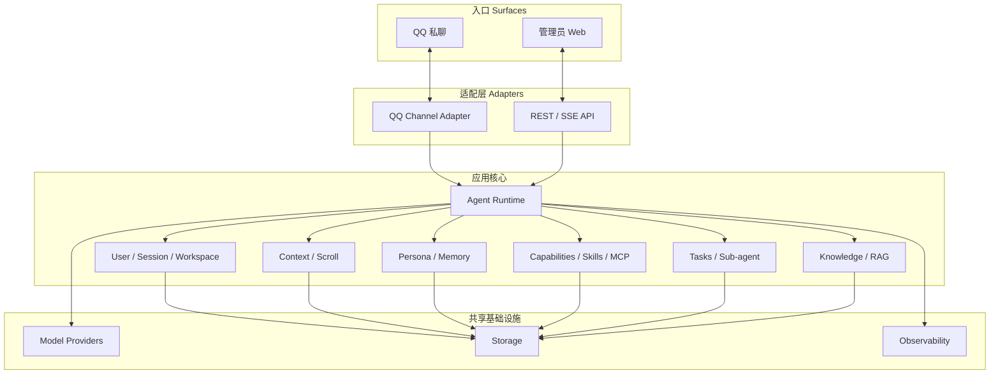
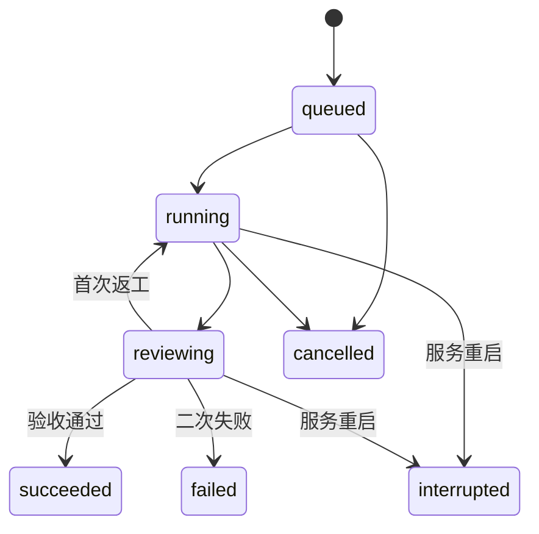

# MindAgent 技术设计

> 状态：Accepted
>
> 本文描述首版实现架构、模块边界和依赖方向。业务范围见 [proposal.md](proposal.md)，强制契约见 [spec.md](spec.md)。

## 1. 设计原则与技术基线

MindAgent 是单进程、单 Agent、多用户隔离的自托管应用。设计遵循：

- **入口与内核分离**：QQ 和 Web 只负责接入，Runtime 不读取 OneBot 原始结构；
- **Workspace 是用户边界**：Session、历史、文件、资料和任务均按内部用户 UUID 隔离；
- **契约先于实现**：跨模块只传递 `domain` 类型和结构化错误；
- **真相来源明确**：app.db 保存全局配置/状态，history.db 保存原始会话，原始知识文件保存知识正文；
- **依赖单向**：入口依赖 Runtime，能力模块依赖 Storage，基础设施不反向依赖业务层；
- **首版克制**：不引入微服务、独立 Worker、插件系统、Skill 脚本执行、沙箱或第二渠道。

| 领域 | 技术选型 |
| --- | --- |
| Python | Python 3.12、FastAPI、Uvicorn、Pydantic v2 |
| 包管理 | `uv`、`pyproject.toml`、`uv.lock` |
| Agent | LangGraph、`langchain-openai` |
| 扩展能力 | 官方 `mcp` Python SDK、PyYAML、标准库 zipfile |
| 数据 | SQLite WAL、aiosqlite、本地文件、Chroma |
| RAG | `langchain-text-splitters`、`langchain-chroma`、`langchain-openai`、`langchain-ollama` |
| QQ | NapCat、OneBot v11、WebSocket |
| Web | React 18、TypeScript、Vite、Ant Design |
| 观测 | 结构化日志、可选 Langfuse |
| 测试 | pytest、pytest-asyncio、Vitest、Playwright |

统一命名：产品 `MindAgent`，仓库 `mind-agent`，Python 包/CLI `mindagent`，环境变量前缀 `MINDAGENT_`，默认数据目录 `~/.mindagent`。

## 2. 总体架构



入口是人或管理员接触系统的表面；Adapter 把外部协议转换为领域契约；Runtime 编排一次 Agent run；Workspace 和各能力模块提供隔离资源；Provider、Storage、Observability 是共享基础设施。

## 3. 入口与请求生命周期

首版入口只有 QQ 私聊和管理员 Web。一次 QQ 请求生命周期：

1. QQ Channel Adapter 接收 OneBot 事件、去重并转换为 `ChannelMessage`；
2. Workspace 服务根据 `(channel, account_id, platform_user_id)` 解析内部用户；
3. 首次触发时原子创建用户、唯一 Session 和 Workspace；
4. Runtime 获取该用户 Session 执行锁并构造 `AgentRequest`；
5. Runtime 组装四文件 Prompt、Scroll 窗口和当前地址，并取得内置工具、MCP 工具/策略与 Skill 目录的不可变快照；
6. LangGraph 执行主 Agent，并逐字持久化消息和工具事件；
7. 短任务直接生成 `AgentResponse`，长任务提交 Task 服务；
8. QQ Adapter 把 `AgentResponse` 转为 OneBot 动作并投递。

同一用户的 run 串行，不同用户并发。`ChannelAddress` 只用于外部历史范围和回复投递，不参与 Session/Workspace 选择。

## 4. 模块边界与依赖方向

```text
api / channels
        ↓
runtime
        ↓
workspaces / context / persona / capabilities / tasks / knowledge / providers
        ↓
storage

domain 被各层复用，但不依赖实现模块
observability 由 app/runtime 注入，不承载业务状态
```

| 模块 | 核心职责 | 禁止依赖 |
| --- | --- | --- |
| `domain` | ID、消息、请求/响应、任务、错误等纯契约 | 任意 I/O 或实现模块 |
| `api` | REST、SSE、认证、管理端协议 | SQL、OneBot、Workspace 内部文件 |
| `channels` | 外部消息协议与领域消息互转 | history.db、任务内部状态、SQL |
| `runtime` | 请求编排、Prompt/工具组装、Agent loop | OneBot 原始结构、直接 SQL |
| `workspaces` | 用户、Session、Workspace、执行锁 | 渠道协议、模型 Provider |
| `context` | history.db、turn、headline、Scroll、recall | QQ 外部历史、知识库 |
| `persona` | 四文件加载、Prompt 片段、用户资料工具 | Session 原始历史、渠道协议 |
| `capabilities` | Tool Registry、Skills、MCP 客户端、策略和审批 | 用户 Workspace 内容、渠道原始协议 |
| `tasks` | 队列、Sub-agent、review、返工 | OneBot 协议、Web 控件 |
| `knowledge` | 文档、切块、索引 generation、只读工具 | 用户 Session、QQ 历史 |
| `providers` | Chat/Embedding Provider 接口 | Workspace 和业务状态 |
| `storage` | SQLite repository、原子文件、安全路径 | API、Channel、Runtime |
| `observability` | 日志、trace、健康状态 | 业务状态所有权 |

## 5. QQ Channel Adapter

`channels/qq/` 封装 NapCat / OneBot v11：

- 反向 WebSocket 连接、事件去重、心跳和动作 `echo` 关联；
- OneBot 消息段与 `ChannelMessage`/`MessageContent` 的双向转换；
- QQ 文件注册和稳定 `file_ref`；
- 当前私聊原始历史查询；
- 只读连接健康状态。

实时事件和历史结果共用一个 Message Converter。接收循环只做转换和排队，不等待文件下载、历史分页或 Agent run。

`query_channel_history` 是本地历史缺口的补偿工具。Gateway 使用 `get_msg` 验证锚点，再调用 `get_friend_msg_history`；返回页只存在于当前 run，不写入 history.db、Workspace 或 headline 索引。

未来新增渠道只实现 `channels/<channel>/` Adapter 和转换测试，不修改 Runtime、Context 或用户隔离逻辑。

## 6. Agent Runtime

Runtime 是一次 Agent run 的应用编排层：

- 接收 `AgentRequest`，解析用户运行上下文；
- 调用 Workspace 获取 Session 锁和目录句柄；
- 调用 Persona 构建系统 Prompt；
- 调用 Context 构建 live window 和 recall 工具；
- 从 Capabilities 取得内置工具、MCP 工具/策略和 Skill 目录快照；
- 注册 Persona、Knowledge、Task 等启用的内置工具以及启用的 MCP 工具；
- 通过 Provider 调用模型并驱动 LangGraph；
- 生成 `AgentResponse`，不直接执行渠道投递。

主 Agent 负责即时回复、短任务和长任务分派。Runtime 不持有持久化真相，不直接读取数据库或平台原始消息。配置热更新只替换后续 run 使用的能力快照，已开始的 run 不被中途改写。

## 7. User / Session / Workspace

Workspace 是 MindAgent 的用户隔离边界，不是 Agent 配置目录。每名内部用户拥有：

- 一个 UUID4 用户 ID；
- 一个稳定绑定的唯一 Session；
- 一个以内部用户 UUID 命名的 Workspace；
- 一个 Session 执行锁。

Workspace 服务负责渠道身份去重、用户/Session/Workspace 原子创建、目录初始化、安全路径解析、文件/产物注册和跨用户拒绝。QQ 平台用户 ID 只保存在 channel identity 中，不用于目录名。

不创建 per-user `agent.json` 或其他 Workspace 配置文件；用户差异只通过 PROFILE.md、MEMORY.md、历史、文件和任务体现。

## 8. Context / Scroll

每个 Workspace 的 `history.db` 是 Session 原始历史真相来源。`session_history` 至少保存 `seq`、`turn_id`、触发地址、角色、正文、tool_call_id、headline 和时间。

一个 turn 从真实用户消息开始，覆盖工具调用/结果和最终回复。最终回复携带隐藏 headline，渲染给用户时移除；缺失时使用用户消息首行截断回退。

上下文构建：

1. 写入新事件；
2. 加载最近完整 turn；
3. 超过 token 预算时驱逐最旧完成 turn；
4. 保留 `[context compressed]` 索引；
5. 最近 20 个被驱逐 turn 逐条显示 headline，更早 turn 折叠为首尾 headline 的 seq 区间。

`recall_session_history(expand)` 按 seq 返回分组原文；`search` 同时检索 headline 和 content。headline 仅用于导航，回答事实前必须读取原文。Context 不调用 QQ 历史，也不跨用户读取。

## 9. Persona / Profile / Memory

Persona 模块读取：

1. `<MINDAGENT_DATA_DIR>/persona/AGENTS.md`；
2. `<MINDAGENT_DATA_DIR>/persona/SOUL.md`；
3. 当前 Workspace 的 `PROFILE.md`；
4. 当前 Workspace 的 `MEMORY.md`。

Prompt Builder 剥离可选 YAML frontmatter，以文件标题分隔后完整拼接正文，并声明全局 AGENTS/SOUL 优先于用户文件。每次 run 重新读取，不缓存内容。

PROFILE/MEMORY 是 Workspace 特殊文件。通用文件工具可读但不可修改、删除或重命名；专用工具从当前 Session 推导 Workspace：

```text
read_user_context_file(file) -> {content, revision, size_bytes}
replace_user_context_file(file, content, expected_revision)
    -> {revision, size_bytes, effective_from: "next_run"}
```

revision 为原文件 SHA-256。新文件必须是 UTF-8 且不超过 32 KiB；写入采用同目录临时文件、flush 和原子替换。首版不实现自动记忆、dream 或 memory_search。

## 10. Global Agent Capabilities

Capabilities 是全局 Agent 能力层，与用户 Workspace 隔离层并列。它由 Tool Registry、SkillService、MCPManager 和 ApprovalService 组成；管理员配置对所有用户生效，但每次调用仍携带当前 `AgentRequest` 的用户、Session 和地址上下文。

### 10.1 内置工具

Tool Registry 在代码中注册工具描述符和处理函数：

```text
ToolDescriptor(
    name,
    description,
    category,
    default_enabled,
    configurable,
    handler
)
```

Repository 只读取 `builtin_tool_settings` 覆盖并与 Registry 合并。列表、单个启停和批量启停都写入同一张覆盖表；`configurable=false` 的 Runtime 基础能力不出现在管理开关中。Snapshot Builder 在 run 开始时解析一次有效工具集，后续不再查询配置。

### 10.2 Skills

SkillService 以 `<MINDAGENT_DATA_DIR>/skills/<skill_key>/` 为内容源，以 app.db 为启停和 revision 源。创建、编辑和 ZIP 导入统一经过 staged directory：校验 key、frontmatter、文件数量、解压大小和所有解析后路径，再原子替换目标目录。

Runtime 向系统 Prompt 添加启用 Skill 的短目录，并注册不可配置的 `read_skill_resource`。该读取器只打开已解析在对应 Skill 根目录内的 UTF-8 文本；references 可按需读取，scripts 只供管理端查看/下载。Skill 目录从不挂载为用户 Workspace，也不传给命令执行工具。

### 10.3 MCP Manager

MCPManager 是进程级异步组件，使用官方 MCP SDK 为启用客户端维护状态化连接：

- 启动时并发连接已启用客户端，单客户端超时或失败只更新其状态；
- 创建、编辑、启停或删除后，只关闭并重建对应客户端；
- 工具发现结果转换为统一 ToolDescriptor，并缓存名称、说明和输入 Schema；
- Runtime 取得连接句柄、白名单和策略的原子快照；调用完成前客户端旧快照保持可用，之后再清理；
- stdio 子进程随客户端关闭，应用退出时在有限超时内关闭全部连接。

模型侧名称使用 `mcp__<client_key>__<sanitized_tool_name>`；映射表保留服务端原始工具名用于真实调用。规范化名称冲突在注册阶段报错。

工具暴露和授权分开求值：先用 `tool_allowlist` 决定是否注册，再按 `tool_effect ?? default_effect` 得到 `allow`、`ask` 或 `deny`。拒绝在连接执行端之前发生；详细的 source/subject 规则不进入领域模型。

### 10.4 Approval Service

ApprovalService 创建一次性、120 秒有效的 pending approval，app.db 保存关联 ID、调用身份、状态和时间，不保存未脱敏凭据。QQ Adapter 在创建普通 AgentRequest 前识别 `/approve <code>` 与 `/deny <code>`，校验原用户、Session 和地址后唤醒等待中的 tool call。Web 测试聊天通过 SSE 发出 `approval_required`，并调用同一决策服务。

服务重启后遗留 pending approval 统一过期；没有实时审批表面的后台 run 不等待，直接返回 `MCP_APPROVAL_UNAVAILABLE`。

## 11. Tasks / Sub-agent / Review

Task 服务使用进程内队列和 Semaphore，每用户默认并发 1、全局 4。任务状态保存到 app.db，任务工作文件保存到用户 Workspace。



Sub-agent 使用独立 run 和任务上下文，只提交候选结果。主 Agent 使用独立 review run 验收，最多自动返工一次。Task 模块保存原始要求、验收条件和原始 `ChannelAddress`，最终通知由 Channel Adapter 投递。

## 12. Knowledge / RAG

Knowledge 是所有 Agent 共享、Agent 只读的全局能力：

- 支持 UTF-8 `.txt` 和 `.md`，单文件不超过 10 MiB；
- `.txt` 递归字符切块，`.md` 先按标题层级再递归切块；
- chunk 保存文档 ID、generation、文件名、标题路径和原文行号；
- OpenAI-compatible 或 Ollama 提供 Embedding；
- 原始文件是真相来源，knowledge.db/Chroma 是可重建派生数据；
- active/pending generation 保证重建或迁移失败时旧索引继续服务。

`search_knowledge` 显式向量检索，`list_knowledge_documents` 列出文档，`read_knowledge_document` 按行读取原文。Knowledge 不读取 Session Scroll、用户资料或 QQ 消息。

## 13. Configuration / Storage

`app.db` 是全局状态和运行配置的真相来源，不新增 config.toml、per-user agent.json 或 Workspace 配置文件。环境变量只提供数据目录、监听地址和首次缺失配置的引导值，不覆盖已有 DB 配置。

```text
<MINDAGENT_DATA_DIR>/                 # 默认 ~/.mindagent
├── app.db                            # 状态、配置和凭据
├── persona/
│   ├── AGENTS.md
│   └── SOUL.md
├── skills/
│   └── <skill-key>/
│       ├── SKILL.md
│       ├── references/
│       └── scripts/                  # 首版只读，不执行
├── knowledge/
│   ├── knowledge.db
│   ├── originals/
│   ├── staging/
│   └── chroma/
├── workspaces/
│   └── <internal-user-uuid>/
│       ├── PROFILE.md
│       ├── MEMORY.md
│       ├── history.db
│       ├── files/
│       ├── artifacts/
│       └── tasks/
└── cache/
```

app.db 至少包含 `admin_sessions`、`users`、`channel_identities`、`agent_sessions`、`workspaces`、`tasks`、`builtin_tool_settings`、`mcp_clients`、`mcp_tool_settings`、`skills`、`tool_approvals`、应用设置、Chat/Embedding 模型配置和 QQ 连接配置。

能力相关表保持窄模型：

```text
builtin_tool_settings(tool_name PK, enabled, updated_at)
mcp_clients(id PK, client_key UNIQUE, name, description, enabled,
            transport, connection_config, secret_config,
            tool_allowlist, default_effect, updated_at)
mcp_tool_settings(client_id FK, tool_name, effect, discovered_at,
                  PK(client_id, tool_name))
skills(id PK, skill_key UNIQUE, enabled, revision, updated_at)
tool_approvals(id PK, run_id, user_id, session_id, tool_call_id,
               tool_name, status, expires_at, decided_at)
```

`connection_config`、`secret_config` 和 `tool_allowlist` 使用 JSON 存储传输专属字段；API 层按 transport 进行 Pydantic 判别校验。`effect` 只接受 `ask/allow/deny`，逐工具记录缺失即表示继承客户端默认策略。

首版凭据与普通配置一起明文保存到 app.db。必须限制 DB 文件权限，API 对 MCP env/headers 和模型密钥只返回掩码及 `configured` 状态，日志/错误脱敏，并提示备份包含凭据。所有 SQLite 连接启用 WAL、foreign keys 和 busy timeout。

## 14. Web / API

`api` 模块只处理 HTTP/SSE 协议、认证、参数验证和 DTO 转换，通过应用服务访问业务能力，不直接执行 SQL。

管理台使用少量非折叠视觉分区，不引入动态菜单注册：

```text
概览

管理
├── 用户                   # 用户详情内管理 Workspace
├── 知识库
└── 任务

智能体
├── 人设文件               # 全局 AGENTS.md / SOUL.md
├── Skills
├── 内置工具
└── MCP

设置
├── 模型
└── QQ 状态                # 只读

测试聊天                   # 固定快捷入口
```

分区只表达当前领域边界：Workspace 是用户隔离数据，不是 Agent 配置目录；Skills、内置工具和 MCP 是全局 Agent 能力。未来真正出现多 Agent、多渠道或大量设置项时，再演进为可折叠层级。

| 页面 | API |
| --- | --- |
| 登录与概览 | `/api/v1/auth/*`、`/healthz`、`/readyz` |
| 用户及其 Workspace | `/api/v1/users/*`、`/api/v1/workspaces/*` |
| 人设文件 | `GET/PUT /api/v1/persona/{file}` |
| 用户 Profile/Memory | `GET/PUT /api/v1/workspaces/{user_id}/context/{file}` |
| Skills | `/api/v1/skills/*` |
| 内置工具 | `/api/v1/tools/*` |
| MCP | `/api/v1/mcp/*` |
| Knowledge | `/api/v1/knowledge/*` |
| Tasks | `/api/v1/tasks/*` |
| Models | `/api/v1/model/*` |
| QQ 状态 | `/api/v1/qq/status` |
| 测试聊天 | `/api/v1/chat/stream` |

QQ 页面只读。模型和 Embedding API key 写入 app.db，响应永远脱敏；空值表示保留原密钥。测试聊天使用带 run_id、递增 sequence、timestamp 和 payload 的 SSE。

Skills API 覆盖列表、创建、保存、ZIP 导入、资源树/文本读取、启停和删除。MCP API 覆盖客户端 CRUD/启停/测试，以及：

```text
GET/PUT /api/v1/mcp/{client_id}/tools
GET/PUT /api/v1/mcp/{client_id}/policy
POST     /api/v1/mcp/{client_id}/policy/clear-tool-effects
POST     /api/v1/tool-approvals/{approval_id}/decision
```

Policy DTO 只包含 `default_effect` 与 `tool_effects[{tool_name,effect}]`；工具列表 DTO 同时返回服务端发现状态、白名单启用状态、有效策略和是否显式覆盖。不得在 API 中出现 source/subject 详细规则字段。

## 15. Providers / Observability / Deployment

`providers` 定义 Chat Model 与 Embedding Provider 接口。OpenAI-compatible 和 Ollama 的专有字段停留在 Provider 实现内，Runtime/Knowledge 只依赖统一接口。新增 Provider 不修改上层能力模块。

每个主 Agent、Sub-agent 和 review run 建立独立 trace；记录 run/session/user/task ID、模型、耗时和当前 ChannelAddress。内置工具、MCP 调用、策略决定与审批建立子 span，但不得记录未脱敏参数或凭据。默认不上传文件正文、密钥、临时 URL 或完整 Workspace 路径。Langfuse 未配置或上报失败时退化为本地结构化日志。

部署只包含一个单 Worker MindAgent 容器、一个 NapCat 容器和持久数据卷。Ollama 是可选外部依赖。单进程使用异步 I/O，阻塞文件解析进入受限执行池。stdio MCP 的命令和依赖必须已存在于 MindAgent 容器内，由管理员负责安装和信任；MindAgent 不自动下载 MCP 包或 Skill 依赖。

## 16. 代码目录、测试与扩展点

```text
src/mindagent/
├── app/             # 配置加载、依赖组装、启动与生命周期
├── domain/          # 纯领域类型、ID、错误和跨模块契约
├── api/             # REST、SSE、认证和管理台接口
├── channels/
│   └── qq/          # NapCat / OneBot v11 私聊适配
├── runtime/         # Agent run 和运行时编排
├── workspaces/      # 用户、Session、Workspace 和执行锁
├── context/         # history、turn、headline、Scroll、recall
├── persona/         # 四文件 Prompt 和用户资料工具
├── capabilities/
│   ├── tools/       # Tool Registry、启停覆盖和工具快照
│   ├── skills/      # Skill 校验、导入和按需读取
│   ├── mcp/         # MCP 客户端、工具发现和策略
│   └── approvals/   # QQ/Web 一次性工具审批
├── tasks/           # TaskManager、Sub-agent、review
├── knowledge/       # 文档、切块、索引和知识工具
├── providers/       # Chat/Embedding Provider
├── storage/         # repository、原子文件和安全路径
└── observability/   # 日志、trace 和健康状态
console/              # React 管理台
tests/                # unit、contract、integration、e2e
deploy/               # MindAgent + NapCat
```

测试按模块边界组织：

- unit：纯转换、路径校验、Scroll、Prompt、Skill/ZIP 校验、MCP 策略求值、切块和状态机；
- contract：ChannelMessage、AgentRequest/Response、Tool Registry、MCP/Skill DTO、Provider、REST/SSE；
- integration：Workspace 隔离、数据库、OneBot、MCP 两种 transport、审批、模型、知识索引和任务恢复；
- e2e：并发 QQ 私聊、管理台菜单、四文件生效、内置工具热更新、MCP 策略/审批、Skill 按需读取、Scroll recall 和长任务验收。

扩展新渠道只新增 Channel Adapter；扩展 Provider 只实现 Provider 接口；新增内置工具只注册 ToolDescriptor；扩展新的能力模块必须通过 domain 契约接入 Runtime，不能绕过 Workspace 隔离、MCP 策略或 Storage 边界。
