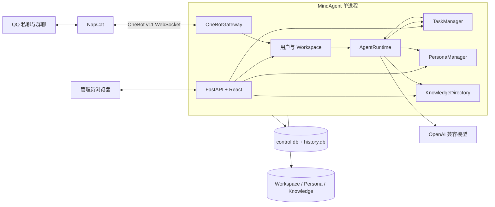
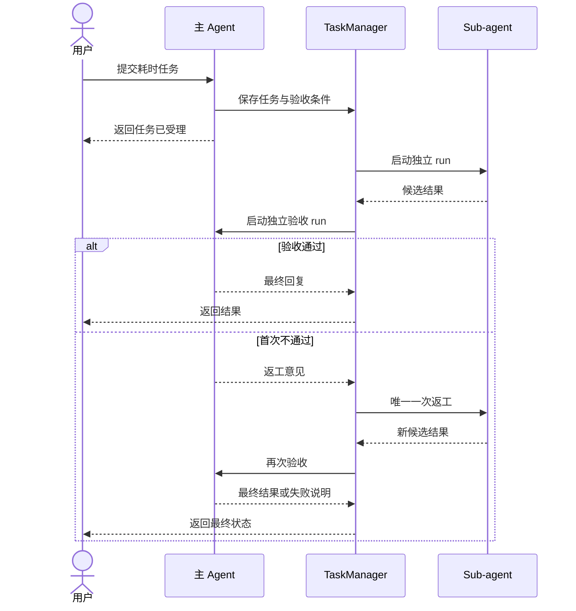

# MindAgent 技术设计

> 状态：Accepted
>
> 本文只描述首版实现。业务范围见 [proposal.md](proposal.md)，强制约束见 [spec.md](spec.md)。

## 1. 技术基线

| 领域 | 选型 |
| --- | --- |
| 后端 | Python 3.12、uv、FastAPI、Uvicorn、Pydantic v2 |
| Agent | LangGraph、LangGraph SQLite Checkpointer |
| 模型 | OpenAI 兼容 API、`langchain-openai` |
| 存储 | 本地目录、SQLite WAL、aiosqlite |
| QQ | NapCat、OneBot v11、websockets |
| 前端 | React 18、TypeScript、Vite、Ant Design |
| 测试 | pytest、pytest-asyncio、Vitest、Playwright |

首版不使用 SQLAlchemy、Alembic、外部数据库、独立 Worker 或微服务。SQLite schema 由轻量 repository 在启动时初始化。

命名统一为：

| 对象 | 名称 |
| --- | --- |
| 产品 | `MindAgent` |
| 仓库 | `mind-agent` |
| Python 包与 CLI | `mindagent` |
| 环境变量前缀 | `MINDAGENT_` |
| 默认数据目录 | `~/.mindagent` |

## 2. 总体架构



部署只包含：

- 一个 MindAgent 容器，使用单个 Uvicorn worker；
- 一个 NapCat 容器；
- 一个数据卷和一个密钥卷。

单进程负责 Web、OneBot、主 Agent、Sub-agent 调度和文件访问。网络调用使用异步 I/O；阻塞文件解析进入受限执行池。

## 3. 消息与会话流程

### 3.1 OneBot 转换

`OneBotGateway` 负责：

- 接收 OneBot v11 事件并去重；
- 把 OneBot 消息段转换为 `UnifiedMessage`；
- 判断私聊或群 `@Agent` 是否触发；
- 按需查询群历史和读取 QQ 文件；
- 把统一输出内容转换为 OneBot 动作；
- 提供只读 QQ 连接状态。

AgentRuntime 只接收统一消息，不依赖 OneBot 数据结构。首版不设计渠道注册、动态能力发现或第二渠道实现。

代码保留独立的统一消息类型和转换边界，未来新增渠道时重新实现转换器即可，不为未来渠道提前建设运行框架。

### 3.2 会话处理

1. OneBotGateway 转换消息并执行触发判断；
2. 首次有效触发时创建用户和 Workspace；
3. 根据私聊或 `(group_id, user_id)` 取得会话锁；
4. AgentRuntime 加载人设、当前 Conversation Scroll 窗口和内置工具；
5. LangGraph 执行主 Agent；
6. OneBotGateway 渲染并发送最终结果；
7. 触发消息、回复和工具结果逐字写入 `history.db`。

不同会话锁可以并发；同一会话按到达顺序执行。

## 4. 简化 Scroll

每个用户 Workspace 拥有独立 `history.db`，其中 `conversation_history` 至少保存：

- `seq`；
- `conversation_id`；
- `role`；
- `content`；
- `tool_call_id`；
- `created_at`。

上下文构建流程：

1. 将新消息写入 `history.db`；
2. 加载当前 Conversation 最近的完整轮次；
3. 若超过模型 token 预算，驱逐最旧的已完成轮次；
4. 在上下文中留下 `[history evicted: seq lo-hi]` 占位；
5. Agent 可调用 `recall_history` 展开区间或搜索当前 Conversation。

`recall_history` 提供：

```text
expand(lo, hi) -> 逐字历史
search(query, limit) -> 当前 Conversation 命中记录
```

实现不生成摘要、headline 或多级索引，不提供 Python REPL，也不读取其他 Conversation。若 SQLite 支持 FTS5，`search` 使用 FTS5；否则降级为参数化 `LIKE`。

## 5. Agent 与异步任务

主 Agent Graph 负责：

- 加载人设和 Scroll 上下文；
- 调用模型和代码内置工具；
- 把耗时任务写入 TaskManager；
- 生成即时回复；
- 验收 Sub-agent 候选结果。

Sub-agent Graph 使用独立 run、checkpoint 和任务目录，只获得任务描述、必要文件和内置工具。



TaskManager 使用进程内队列和 Semaphore，默认限制每用户 1 个、全局 4 个 Sub-agent。任务状态持久化到 `control.db`；启动时继续 `queued`，将遗留 `running` 和 `reviewing` 标记为 `interrupted`。

## 6. 全局人设

全局人设位于：

```text
persona/
├── AGENTS.md
├── SOUL.md
└── PROFILE.md
```

`PersonaManager` 只提供固定三文件的读取与保存：

- Web 保存时校验文件名并原子替换；
- 每次 Agent run 按固定顺序读取，不维护缓存和文件监听器；
- 初始化时缺少文件则从内置中文模板创建；
- 不实现文件增删、启停、排序和首次引导流程。

## 7. 知识库

知识库位于 `knowledge/`，文件系统是真相来源，不建立数据库索引。

`KnowledgeDirectory` 提供：

- 管理员 Web 的目录列举、创建、上传、覆盖、移动和删除；
- Agent 的 `list_knowledge_files` 和 `read_knowledge_file` 只读工具；
- 路径规范化、边界校验和符号链接拒绝。

文本文件直接返回内容。PDF、Office 等格式如果普通文件读取工具已经支持则复用；否则返回明确的不支持错误。首版不单独建设文档解析、分块或检索流水线。

## 8. 存储布局

```text
<MINDAGENT_DATA_DIR>/
├── control.db
├── persona/
│   ├── AGENTS.md
│   ├── SOUL.md
│   └── PROFILE.md
├── knowledge/
├── workspaces/
│   └── <user-id>/
│       ├── history.db
│       ├── files/
│       ├── artifacts/
│       └── tasks/
├── cache/
└── secrets/
```

`control.db` 只保存管理员会话、用户、渠道身份、Workspace 注册和任务状态。用户消息与工具历史保存在各自 `history.db`，文件正文保存在目录中。

所有 SQLite 连接启用 WAL、foreign keys 和 busy timeout。Markdown 与普通配置文件使用临时文件和原子替换。

## 9. Web 工作台

首版页面与 API 分组固定为：

| 页面 | API |
| --- | --- |
| 登录与概览 | `/api/v1/auth/*`、`/healthz`、`/readyz` |
| 用户 | `/api/v1/users/*` |
| Workspace 文件 | `/api/v1/workspaces/*` |
| 人设 | `/api/v1/persona/*` |
| 知识库 | `/api/v1/knowledge/*` |
| 任务 | `/api/v1/tasks/*` |
| 模型 | `/api/v1/model/*` |
| QQ 状态 | `/api/v1/qq/status` |
| 测试聊天 | `/api/v1/chat/stream` |

QQ 状态接口只返回连接状态、登录账号、连接时间和最近错误。QQ 连接参数通过环境变量或本地配置提供，不在 Web 修改。

首版不存在 Skills、记忆、备份恢复、迁移、渠道管理和通用设置页面或 API。

## 10. 代码目录

```text
src/mindagent/
├── app/          # 配置、组装与生命周期
├── api/          # REST、SSE 与认证
├── agent/        # LangGraph、上下文和内置工具
├── onebot/       # OneBotGateway 与消息转换
├── workspaces/   # 用户与 Workspace
├── tasks/        # 异步任务与验收
├── persona/      # 固定人设文件
├── knowledge/    # 知识库目录
└── storage/      # aiosqlite 与安全文件访问
console/          # React 管理台
tests/            # unit、contract、integration、e2e
deploy/           # MindAgent + NapCat
```

模块只能通过公开接口协作。`agent` 不直接解析 OneBot 数据，`onebot` 不直接访问 Workspace 内部文件，`api` 不直接执行 SQL。

## 11. 测试重点

- OneBot 与统一消息双向转换；
- 群触发、用户隔离和同会话顺序；
- Scroll 驱逐、展开、搜索和跨 Conversation 拒绝；
- 人设三文件原子写入和下一 run 生效；
- 知识库权限与路径安全；
- Sub-agent 并发、验收和一次返工；
- QQ 状态只读；
- Web 不暴露首版以外页面和 API。
