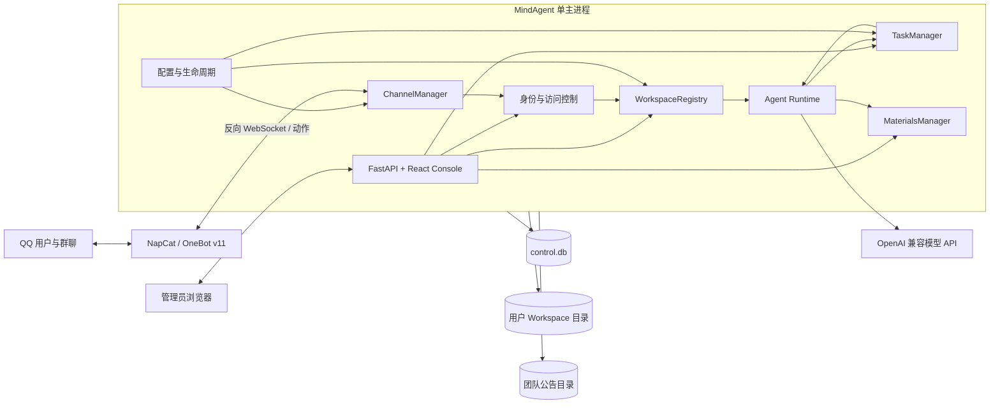
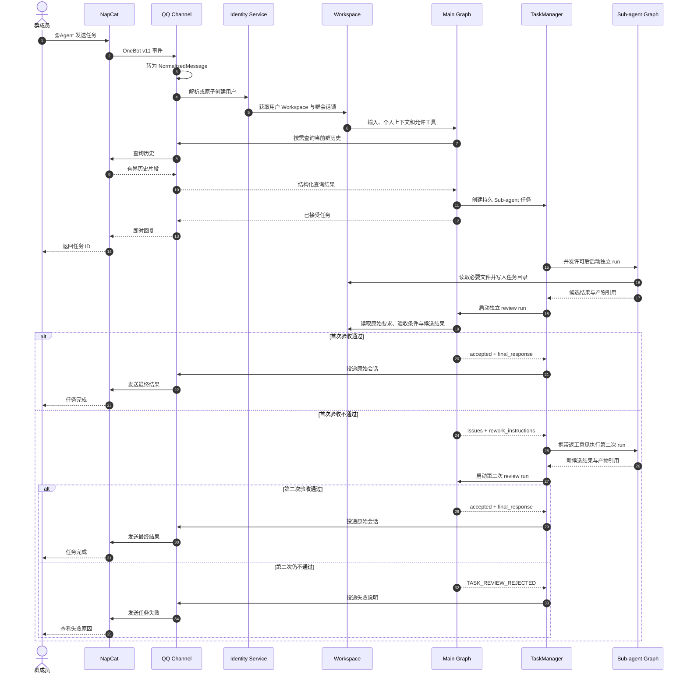

# MindAgent 技术设计

> 状态：Accepted
>
> 本文描述首版实现方案。业务范围以 [proposal.md](proposal.md) 为准，强制行为与接口以 [spec.md](spec.md) 为准。本文不得用于绕过或扩大两者。

## 1. 设计目标

首版采用单机、单主进程、文件系统优先的模块化单体，目标是：

- 以较低部署成本支持一个团队内的多用户并发；
- 让每名用户的 Workspace 在磁盘上透明、独立、可备份；
- 让主 Agent 和 Sub-agent 共享运行基座但隔离上下文；
- 保持 QQ 接入与核心领域模型分离，为未来渠道扩展留出稳定契约；
- 使用持久任务状态和 LangGraph checkpoint，避免进程内状态成为唯一事实来源；
- 不提前引入外部数据库、独立 Worker 或领域微服务。

## 2. 技术基线

### 2.1 后端

| 领域 | 选型 | 用途 |
| --- | --- | --- |
| 语言与包管理 | Python 3.12、uv | 单 Python 包与锁定依赖 |
| Web | FastAPI、Uvicorn | REST、SSE、OneBot WebSocket、静态 Console |
| 数据模型 | Pydantic v2 | 配置、API、消息和领域边界校验 |
| Agent | LangGraph | 主 Agent 与 Sub-agent 状态图 |
| 模型 | OpenAI 兼容 API、`langchain-openai` | 首版唯一正式模型协议 |
| Checkpoint | LangGraph SQLite Checkpointer | 按 Workspace 持久化 run 状态 |
| 结构化存储 | SQLAlchemy 2、aiosqlite、Alembic | `control.db`、Workspace `history.db` 与迁移 |
| 网络 | httpx、websockets | 模型、文件和渠道调用 |
| 安全 | Argon2id、加密密钥存储 | Web 密码与敏感配置 |
| 日志 | Python logging + JSON formatter | 结构化日志与关联 ID |

版本使用兼容范围声明，最终解析版本由 `uv.lock` 和前端 lockfile 固定。首版不实现 Anthropic 原生协议、多 Provider 管理或本地模型下载。

### 2.2 前端

| 领域 | 选型 |
| --- | --- |
| UI | React 18、TypeScript、Vite、Ant Design |
| 路由 | React Router |
| 服务端状态 | TanStack Query |
| 客户端状态 | Zustand |
| 测试 | Vitest、Testing Library、Playwright |

Console 构建产物由 FastAPI 作为静态资源发布。开发模式下 Vite 代理 `/api` 与 SSE 请求到后端。

### 2.3 测试与质量

- Python：pytest、pytest-asyncio、pytest-cov、Ruff、Pyright；
- 前端：Vitest、Testing Library、Playwright、ESLint、Prettier；
- 仓库：pre-commit、契约测试、Docker Compose 端到端测试。

### 2.4 命名约定

| 对象 | 固定名称 |
| --- | --- |
| 产品 | `MindAgent` |
| 仓库名 | `mind-agent` |
| Python distribution | `mindagent` |
| Python import package | `mindagent` |
| CLI | `mindagent` |
| 环境变量前缀 | `MINDAGENT_` |
| Docker Compose service | `mindagent` |
| 本机默认数据目录 | `~/.mindagent` |
| 容器默认数据目录 | `/app/data` |

代码、配置、日志 service name、镜像标签和运维命令 MUST 使用上述名称，不得继续产生任何旧项目名称或前缀。

## 3. 总体架构



首版部署包含：

1. 一个 MindAgent 容器：单个 Uvicorn worker，承载全部后端与 Console；
2. 一个 NapCat 容器：负责 QQ 登录与 OneBot v11；
3. 持久化数据卷和独立密钥卷。

MUST 使用单个 Uvicorn worker。多 worker 会破坏进程内上下文锁、任务调度和短期群历史缓存的一致性，首版禁止启用。

## 4. 请求与任务流程



### 4.1 输入管线

1. Channel 接收平台事件并完成去重；
2. Channel 只负责转换为 `NormalizedMessage`，不得访问 Workspace 内部状态；
3. TriggerPolicy 判断私聊或群 `@Agent`；普通群消息到此终止；
4. IdentityService 原子解析或创建 User、ChannelIdentity 和 Workspace；
5. Dispatcher 生成会话键并取得该键的 `asyncio.Lock`；
6. WorkspaceRegistry 懒加载 Workspace 服务；
7. Main Graph 执行并产生统一输出事件；
8. ChannelRenderer 根据 QQ 能力渲染并发送结果；
9. 运行状态、checkpoint 和触发消息写入当前 Workspace。

### 4.2 主 Agent 图

Main Graph 提供普通会话和任务验收两个入口。普通会话固定包含：

1. `load_context`：加载当前会话、用户记忆和任务状态；
2. `assemble_capabilities`：组装当前 Skills、工具、公告只读工具及 QQ 能力；
3. `model`：调用 OpenAI 兼容模型；
4. `execute_tool`：校验权限后执行短时工具；
5. `dispatch_task`：把耗时任务持久化并交给 TaskManager；
6. `render_response`：生成统一内容段；
7. `persist`：保存 checkpoint、消息和工具结果。

Graph state MUST 包含 `run_id`、`workspace_id`、`conversation_id` 和 `channel_context`。工具只能通过领域端口访问文件、资料、任务和渠道，不得读取全局绝对路径。

任务验收入口不复用普通会话 checkpoint，只复用主 Agent 的模型、人格、输出规则和只读验证能力，具体流程见 4.4。

### 4.3 Sub-agent 图

Sub-agent Graph 固定包含：

1. `load_task`：加载任务描述、选定文件引用和最小权限；
2. `model`：规划下一步；
3. `execute_tool`：执行允许的任务工具；
4. `checkpoint`：每轮持久化状态；
5. `finalize`：保存候选结果、执行摘要和产物引用，并提交 TaskManager 验收。

Sub-agent 不继承主会话全量历史，不注册创建 Sub-agent 的工具，也不注册公告写入工具。Sub-agent 不调用 ChannelManager，任何候选内容都不得直接发送给用户。

### 4.4 主 Agent 验收 run

每份 Sub-agent 候选结果触发一次独立的主 Agent review run：

1. `load_review_context`：加载任务创建时冻结的原始需求和验收条件；
2. `load_candidate`：读取候选结果、执行摘要和产物引用；
3. `verify`：使用只读文件、公告和查询工具核对要求；
4. `decide`：输出符合 `TaskReviewDecision` schema 的验收结论；
5. `persist_review`：保存结论、问题和最终回复或返工要求。

review run 使用独立 `run_id` 和 checkpoint namespace，不持有普通会话锁，也不把中间推理写入普通会话历史。验收通过后，TaskManager 才取得原会话锁，将 `final_response` 追加到会话并交给 ChannelManager。

首次拒绝时，TaskManager 将 `rework_instructions` 注入第二次 Sub-agent run。第二次候选结果再执行一次 review；仍被拒绝时以 `TASK_REVIEW_REJECTED` 结束，不再调度新的 Sub-agent。

### 4.5 TaskManager

TaskManager 运行于 MindAgent 进程内，职责包括：

- 从 `control.db` 读取 `queued` 任务；
- 通过全局 Semaphore 和每用户 Semaphore 执行默认 4/1 并发限制；
- 启动、取消和监控 Sub-agent asyncio task；
- 保存候选结果并将任务从 `running` 转为 `reviewing`；
- 启动和监控主 Agent review run，校验结构化验收结论；
- 验收通过后保存最终回复并调用 ChannelManager 投递；
- 首次验收拒绝时携带返工意见重新排队，最多返工一次；
- 第二次验收拒绝时记录 `TASK_REVIEW_REJECTED` 并投递失败说明；
- 更新持久状态和追加执行、验收、返工与投递事件；
- 启动时将遗留 `running` 或 `reviewing` 任务标记为 `interrupted`；
- 重新调度 `queued` 任务，但不自动重放 `interrupted` 任务。

网络 I/O 使用 async；阻塞库使用有界 ThreadPoolExecutor；明确为 CPU 密集的解析使用有界 ProcessPoolExecutor。执行池大小必须可配置并有保守默认值。

## 5. 渠道设计

### 5.1 渠道端口

所有渠道实现统一接口：

```text
start() -> None
stop() -> None
normalize(raw_event) -> NormalizedMessage | IgnoredEvent
send(target, content_parts) -> DeliveryResult
query_history(conversation, cursor?, limit?) -> HistoryPage
open_file(file_ref) -> FileStream
capabilities() -> ChannelCapabilities
health() -> ChannelHealth
```

`ChannelCapabilities` 声明消息类型、历史查询、文件发送和平台动作。Agent 只能看到当前渠道实际支持的能力。

### 5.2 QQ 实现

- NapCat 使用 OneBot v11 反向 WebSocket 连接 MindAgent；
- QQ Channel 运行在 MindAgent 主进程中，不单独部署 Python Adapter；
- 接收事件、动作响应和心跳共享一条连接，并使用请求 ID 关联响应；
- 文件引用由 QQ Channel 管理，只有在 Agent 调用文件读取时才下载；
- 群历史通过 NapCat 动作按游标或消息 ID 查询；
- QQ 表情、戳一戳等平台能力使用 `extension` 内容段；
- OneBot 原始字段不得泄漏到领域层或 Agent Graph state。

## 6. 存储设计

### 6.1 运行目录

数据根目录由 `MINDAGENT_DATA_DIR` 指定；本机默认 `~/.mindagent`，容器默认 `/app/data`：

```text
<MINDAGENT_DATA_DIR>/
├── control.db
├── shared/
│   └── materials/
├── workspaces/
│   └── <user-id>/
│       ├── workspace.json
│       ├── MEMORY.md
│       ├── memory/
│       ├── history.db
│       ├── files/
│       ├── artifacts/
│       ├── tasks/
│       └── skills/
├── cache/
└── secrets/
```

数据根目录不进入版本库。Docker 中普通数据与 `secrets/` 使用不同 volume 挂载；备份默认不包含密钥，只有管理员显式选择后才导出加密密钥包。

### 6.2 control.db

`control.db` 是控制面数据库，包含：

- `schema_migrations`；
- `admin_accounts`、`admin_sessions`；
- `users`、`channel_identities`、`workspaces`；
- `groups` 与渠道账号元数据；
- `agent_tasks`、`task_events`、`delivery_attempts`；
- `public_materials` 索引；
- 非敏感系统配置版本。

禁止把私人文件、记忆正文、公告文件正文和任务产物写入 `control.db`。

### 6.3 Workspace history.db

每个 Workspace 有独立 `history.db`，包含：

- `conversations`；
- `messages` 与结构化内容段；
- `run_events`；
- LangGraph SQLite Checkpointer 管理的 checkpoint 表。

只有触发 Agent 的消息、Agent 回复、工具事件和任务关联事件进入 `history.db`。普通未触发群消息不得写入。

### 6.4 文件与记忆

- `workspace.json`、Markdown 和 JSON 使用同目录临时文件、`fsync`、原子替换；
- `MEMORY.md` 保存稳定长期记忆，`memory/` 保存来源明确的增量记录；
- QQ 临时媒体先进入 `cache/`，只有明确保存时才复制到 Workspace；
- 文件使用 UUID 引用，元数据保存相对路径、MIME、大小和 SHA-256；
- 公告资料正文以 `shared/materials/` 为真相来源，`public_materials` 只是可重建索引；
- 公告目录拒绝符号链接和解析后越界路径。

### 6.5 SQLite 约束

所有 SQLite 连接启用：

- WAL journal mode；
- foreign keys；
- busy timeout；
- 显式事务；
- 应用级迁移版本。

跨库操作无法组成单一事务。涉及 `control.db` 与 Workspace 目录/数据库的流程必须使用“准备目录 → 控制面事务 → 完成标记”的可补偿步骤；启动时扫描并清理未完成初始化。

## 7. Web 工作台

### 7.1 认证

- 首次安装通过 `mindagent init` 创建管理员；
- 非交互部署可用一次性环境变量提供初始用户名和密码，启动成功后不得回显；
- 密码使用 Argon2id；
- 登录成功后签发服务端 session，Cookie 设置 `HttpOnly`、`SameSite=Strict`，生产 HTTPS 下设置 `Secure`；
- 修改类请求必须校验 CSRF token；
- 管理员退出、禁用或修改密码时必须撤销相关 session。

### 7.2 页面

Console 固定包含：

- 登录；
- 系统状态；
- 用户与 Workspace；
- 对话与记忆；
- 文件与任务；
- 团队公告资料；
- QQ 渠道；
- 模型、Skills 与工具；
- 系统配置；
- 备份与恢复；
- 管理员测试聊天；每次测试必须显式选择目标 Workspace，并清楚展示数据将写入的位置。

管理员可以查看全部私有数据。所有删除、覆盖、恢复和禁用操作必须有二次确认。

### 7.3 API 路由

首版路由按领域分组：

```text
/healthz
/readyz
/onebot/v11/ws
/api/v1/auth/*
/api/v1/users/*
/api/v1/workspaces/*
/api/v1/materials/*
/api/v1/tasks/*
/api/v1/channels/*
/api/v1/models/*
/api/v1/skills/*
/api/v1/settings/*
/api/v1/backups/*
/api/v1/chat/stream
```

所有 `/api/v1` 响应和 SSE 必须遵循 `spec.md`。OpenAPI 是 Console API 类型生成的真相来源。

## 8. 代码目录

```text
.
├── src/
│   └── mindagent/
│       ├── app/              # 组装、生命周期、配置
│       ├── api/              # REST、SSE、WebSocket、Web 认证
│       ├── domain/           # 实体、值对象、端口、策略、错误
│       ├── agents/           # LangGraph 主图、Sub-agent 图、工具
│       ├── channels/         # 渠道契约、ChannelManager、QQ 实现
│       ├── workspaces/       # Workspace 注册、路径与存储
│       ├── tasks/            # 持久任务调度与恢复
│       ├── materials/        # 公告目录和只读 Agent 工具
│       └── infrastructure/   # SQLite、文件系统、模型与安全实现
├── console/                  # React 管理工作台
├── tests/
│   ├── unit/
│   ├── contract/
│   ├── integration/
│   └── e2e/
├── deploy/                   # Docker Compose、镜像与 NapCat 配置
├── scripts/
└── docs/
```

依赖方向：

- `domain` 禁止依赖 FastAPI、LangGraph、SQLite、OneBot 或前端；
- `agents`、`channels`、`workspaces`、`tasks`、`materials` 依赖 `domain` 端口；
- `infrastructure` 实现领域端口；
- `api` 调用应用用例，不直接编写 SQL 或拼接 Workspace 路径；
- `app` 是唯一选择具体实现并完成生命周期组装的入口；
- 跨模块协作通过明确接口，不允许从其他模块导入内部实现文件。

## 9. 配置与依赖管理

- 根 `pyproject.toml` 管理 Python 包、工具配置和 CLI；
- `uv.lock` 必须提交；
- `console/package.json` 与 lockfile 必须提交；
- 配置由类型化 Settings 读取，优先级为环境变量、用户配置、默认值；
- 密钥不得出现在普通配置、日志、错误响应和版本库；
- 示例配置只包含占位值；
- 数据库迁移由 Alembic 管理，启动时只检查版本，不自动执行破坏性迁移；
- `mindagent migrate` 显式执行迁移，升级文档必须说明备份与回滚步骤。

## 10. 可靠性与可观测性

- 每个外部请求生成 `request_id`；每次 Agent 运行生成 `run_id`；每个任务使用 `task_id`；
- 结构化日志必须携带适用的 `request_id`、`run_id`、`task_id`、`workspace_id`、`channel`；
- 日志不得记录模型 Key、Cookie、私有文件正文或完整用户记忆；
- `/healthz` 只报告进程存活；`/readyz` 检查数据库、数据目录、模型配置和 QQ Channel 状态；
- 模型、工具、渠道和任务错误使用稳定错误码；
- 首版只提供操作排障所需日志与状态，不建设企业审计平台和精细资源计费。

## 11. 测试架构

- 单元测试：领域策略、触发规则、路径边界、含 `reviewing` 与返工的任务状态机、内容段转换；
- 契约测试：统一消息、REST、SSE、`TaskReviewDecision`、工具结果、Channel 接口、OpenAPI；
- 集成测试：SQLite 迁移、原子创建 Workspace、LangGraph checkpoint、候选结果验收、一次返工、任务重启语义、公告目录索引；
- 并发测试：同身份首次创建、同上下文串行、不同用户并行、任务 1/4 限制；
- 安全测试：认证、CSRF、路径穿越、符号链接、跨 Workspace 引用、密钥脱敏；
- 前端测试：管理员主要页面、危险操作确认、SSE 重连和错误展示；
- E2E：NapCat 测试环境或协议替身覆盖 QQ 私聊、群 `@`、群历史、媒体、Sub-agent 候选结果、主 Agent 验收、返工与最终结果回投。

发布门禁必须覆盖 [spec.md](spec.md) 的全部验收场景。
