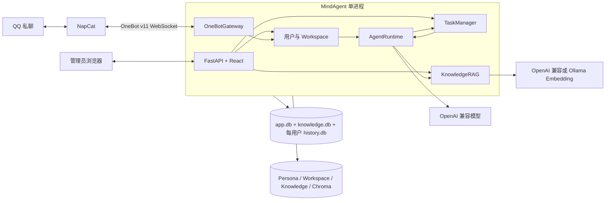
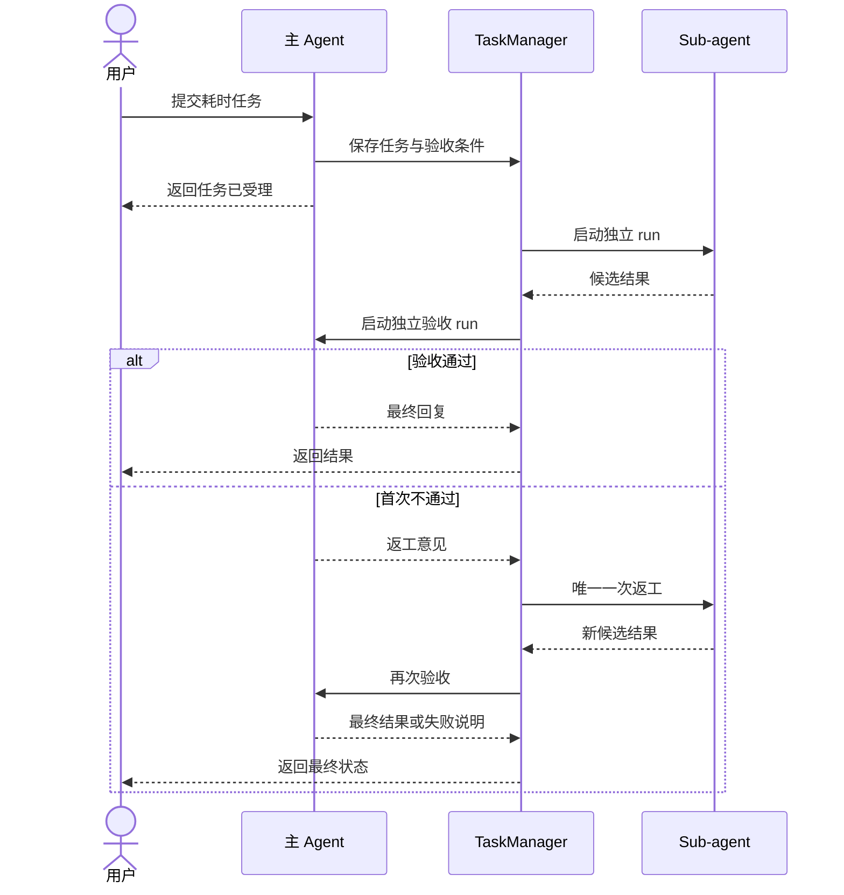

# MindAgent 技术设计

> 状态：Accepted
>
> 本文只描述首版实现。业务范围见 [proposal.md](proposal.md)，强制约束见 [spec.md](spec.md)。

## 1. 技术基线

| 领域 | 选型 |
| --- | --- |
| Python 运行时 | Python 3.12、FastAPI、Uvicorn、Pydantic v2 |
| 包与环境管理 | `uv`、`pyproject.toml`、`uv.lock` |
| Agent | LangGraph |
| 可观测性 | Python 结构化日志、可选 Langfuse |
| 模型 | OpenAI 兼容 API、`langchain-openai` |
| RAG | `langchain-text-splitters`、`langchain-chroma`、`langchain-openai`、`langchain-ollama` |
| 存储 | 本地目录、SQLite WAL、aiosqlite、Chroma |
| QQ | NapCat、OneBot v11、websockets |
| 前端 | React 18、TypeScript、Vite、Ant Design |
| 测试 | pytest、pytest-asyncio、Vitest、Playwright |

首版不使用 SQLAlchemy、Alembic、外部数据库、独立 Worker 或微服务。SQLite schema 由轻量 repository 在启动时初始化。

`uv` 负责 Python 版本、虚拟环境、依赖解析、锁文件和命令执行；FastAPI/Uvicorn 负责后端运行。

命名统一为：

| 对象 | 名称 |
| --- | --- |
| 产品 | `MindAgent` |
| 仓库 | `mind-agent` |
| Python 包与 CLI | `mindagent` |
| 环境变量前缀 | `MINDAGENT_` |
| 默认数据目录 | `~/.mindagent` |

## 2. 总体架构



部署只包含：

- 一个 MindAgent 容器，使用单个 Uvicorn worker；
- 一个 NapCat 容器；
- 一个数据卷和一个密钥卷。

选择 Ollama Embedding 时，Ollama 是用户自行部署的外部依赖，不加入 MindAgent Compose。

单进程负责 Web、OneBot、主 Agent、Sub-agent 调度和文件访问。网络调用使用异步 I/O；阻塞文件解析进入受限执行池。

## 3. 消息与 Session 流程

### 3.1 OneBot 网关与转换

`OneBotGateway` 负责：

- 接收 OneBot v11 事件并去重；
- 把 OneBot 消息段转换为 `ChannelMessage`；
- 判断私聊消息并触发 Agent；
- 按需查询当前私聊的消息记录，并读取 QQ 文件；
- 把统一输出内容转换为 OneBot 动作；
- 提供只读 QQ 连接状态。

`OneBotGateway` 通过 FastAPI WebSocket 端点接受 NapCat 的反向 WebSocket 连接。发送动作使用唯一 `echo` 与进程内 Future 关联响应；接收循环不得等待耗时的文件读取、历史查询或 Agent run。生命周期事件、心跳、连接数、最近错误和待响应动作数进入健康状态与结构化日志。

OneBotGateway 只向运行层输出 `ChannelMessage`，运行层不依赖 OneBot 数据结构。首版不设计渠道注册、动态能力发现或第二渠道实现。

统一类型采用 `ChannelMessage`、`ChannelAddress`、`MessageContent`、`TextContent`、`MentionContent`、`QuoteContent`、`ImageContent`、`AudioContent`、`VideoContent`、`FileContent` 和 `UnsupportedContent`。`ChannelAddress.conversation_type` 首版固定为 `private`，路由字段使用显式的强类型数据。

实时事件和历史查询结果必须调用同一个 `OneBotMessageConverter`，并完整保留 text、mention、quote、image、audio、video、file 和 unsupported content。

### 3.2 Session 处理

1. OneBotGateway 转换消息并执行触发判断；
2. 首次有效触发时创建用户、Session 和 Workspace；
3. 根据用户 ID 取得该用户唯一 Session 的执行锁；
4. AgentRuntime 加载人设、用户 Session 的 Scroll 窗口、当前私聊地址和内置工具；
5. LangGraph 执行主 Agent；
6. OneBotGateway 渲染并发送最终结果；
7. 触发消息、回复和工具结果逐字写入 `history.db`。

不同用户的 Session 锁可以并发；同一用户的私聊消息按到达顺序在同一 Session 中执行。私聊地址只用于查询本次交互相关的渠道消息和投递回复，不参与 Session 或 Workspace 的选择。

身份解析后由运行层构造 `AgentRequest`，至少包含 `run_id`、`user_id`、`session_id` 和 `trigger_message: ChannelMessage`；Session 标识不得塞回 `ChannelAddress`。Agent 最终返回 `AgentResponse`，其中 `content: MessageContent[]` 与 `artifact_refs` 交给 OneBotGateway 渲染。

### 3.3 渠道消息历史查询

`query_channel_history` 专门查询当前私聊的 QQ 消息记录：

```text
query_channel_history(
    anchor_message_id?: string,
    cursor?: string,
    limit: integer = 20,
    include_anchor: boolean = true
) -> ChannelMessagePage
```

- 首次调用使用 `anchor_message_id`，省略时默认定位到当前触发消息；`cursor` 只用于后续向更早消息翻页，两者不得同时提供；
- Gateway 优先调用 OneBot `get_msg` 验证锚点并取得可用于定位的 `message_seq`，再按当前 `ChannelAddress` 调用 NapCat 的 `get_friend_msg_history`；
- 如果 NapCat 版本不能由消息 ID 稳定定位，Gateway 返回结构化 `ANCHOR_UNSUPPORTED`，不得悄悄改成“最新 N 条”；
- 返回页包含统一的 `ChannelMessage[]`、不透明 `next_cursor` 和 `has_more`，消息统一按时间正序排列；
- 每条历史记录经过与实时事件相同的 OneBot 转换、文件注册和降级处理；
- Gateway 校验返回消息仍属于当前账号、`private` 会话和当前窗口，Agent 不能借工具读取其他私聊；
- 查询页只存在于当前 run，不写入 `history.db`、headline 索引或 Workspace。

`message_id` 是 Agent 可见的稳定定位键，`message_seq` 和分页 cursor 是 OneBot/NapCat 实现细节。首版只保证“定位某条消息并向更早记录翻页”；向更新消息查询或任意时间范围检索留待 OneBotGateway 能力明确后再增加。

`query_channel_history` 是 QQ 原始历史的补偿工具。Agent 应优先使用 `recall_session_history`；只有本地历史缺失、Agent 启用前记录或服务漏接时才调用它。

## 4. 简化 Scroll

每个用户 Workspace 拥有独立 `history.db`，其中 `session_history` 至少保存：

- `seq`；
- `turn_id`；
- `trigger_account_id`；
- `trigger_conversation_type`（首版固定为 `private`）；
- `trigger_conversation_id`；
- `role`；
- `content`；
- `tool_call_id`；
- `headline`（最终 Agent 回复的单行导航标题）；
- `created_at`。

一个完整回合从真实用户消息开始，覆盖该轮工具调用、工具结果和最终 Agent 回复；同一回合的记录共享 `turn_id`，回合范围由其最小和最大 `seq` 确定。最终 Agent 回复在文本末尾生成隐藏 headline，例如：

```html
<!-- ⟦用户确认采用 OpenAI Embedding⟧ -->
```

headline 不超过 200 个字符，目标约 15 个词；渲染到 QQ 或管理台时移除隐藏注释，但正文和独立 headline 字段均保留。缺失或格式无效时，用该回合首条非空用户文本的首行截断值回退，不额外调用模型生成标题。

上下文构建流程：

1. 将新消息写入 `history.db`；
2. 加载当前用户 Session 最近的完整轮次，不拆开回合；
3. 若超过模型 token 预算，驱逐最旧的已完成轮次；
4. 在上下文中留下 `[context compressed]` 索引：最近 20 个被驱逐回合逐条显示 `seq_lo-seq_hi · headline`，更早回合合并为一个 seq 区间并保留首尾 headline；
5. Agent 可调用 `recall_session_history` 展开区间或搜索当前用户 Session。

`recall_session_history` 提供：

```text
expand(lo, hi) -> 按 turn_id 分组的逐字历史与 headline
search(query, limit) -> 当前用户 Session 中匹配 headline 或正文的回合与 seq 区间
```

实现不生成摘要，不提供 Python REPL，也不读取其他用户的 Session。headline 只用于导航，不能替代正文事实；精选的用户资料和长期决策由 PROFILE.md/MEMORY.md 独立维护。若 SQLite 支持 FTS5，`search` 同时索引 headline 和 content；否则降级为参数化 `LIKE`。

`recall_session_history` 返回内部 `SessionHistoryEntry`（如 `seq`、`turn_id`、`role`、`content`、`tool_call_id`、`headline`），数据源是用户 Workspace 的 `history.db`。它与返回 `ChannelMessagePage` 的 `query_channel_history` 是两个独立工具：前者回忆 Agent 与该用户的交互，后者只在缺口场景查看当前 QQ 私聊的外部聊天记录。

## 5. Agent 与异步任务

主 Agent Graph 负责：

- 加载人设和 Scroll 上下文；
- 调用模型和代码内置工具；
- 把耗时任务写入 TaskManager；
- 生成即时回复；
- 验收 Sub-agent 候选结果。

Sub-agent Graph 使用独立 run、任务上下文和任务目录，只获得任务描述、必要文件和内置工具。



TaskManager 使用进程内队列和 Semaphore，默认限制每用户 1 个、全局 4 个 Sub-agent。任务状态持久化到 `app.db`；启动时继续 `queued`，将遗留 `running` 和 `reviewing` 标记为 `interrupted`。

### 5.1 Langfuse

LangGraph 本身不内置 Langfuse 后端。Langfuse 通过 LangChain CallbackHandler 接入，而 LangGraph 会沿 `RunnableConfig.callbacks` 传播回调；因此在每次 `graph.ainvoke` / `graph.astream` 时传入 `langfuse.langchain.CallbackHandler`，可以关联模型调用、部分节点和工具事件。自定义的队列、文件处理和未经过 LangChain Runnable 的代码仍需显式创建 span。

每个主 Agent run、Sub-agent run 和 review run 建立独立 trace，至少写入 `run_id`、`session_id`、`user_id`、`task_id`、run 类型、模型、当前 `ChannelAddress` 和耗时。工具调用作为子 span，LLM 调用记录 token、延迟、错误和模型参数。默认不上传文件正文、密钥、临时下载 URL 和完整 Workspace 路径；消息正文是否采集由配置控制。

Langfuse 通过环境变量启用，未配置或上报失败时必须退化为本地结构化日志，不得影响 Agent run。服务关闭时在有限超时内 flush。

## 6. 人设与用户记忆

人设采用两层作用域：

- 全局 `AGENTS.md` 和 `SOUL.md` 由管理员维护，对所有用户生效；
- 每个用户 Workspace 下的 `PROFILE.md` 和 `MEMORY.md` 只对该用户生效。

AgentRuntime 每次 run 通过文件存储层读取四个文件，剥离可选 YAML frontmatter，并按 `AGENTS.md → SOUL.md → PROFILE.md → MEMORY.md` 顺序以文件标题分隔后完整拼入系统提示词。Prompt 外层固定声明全局规则优先，用户文件不得覆盖 AGENTS.md/SOUL.md 的安全和权限约束；不维护内容缓存或文件监听器。

初始化模板沿用 QwenPaw 的职责、语气和章节结构，但移除 Skills、heartbeat、群聊等未支持能力。AGENTS.md 保存工作规则与安全约束，SOUL.md 保存 Agent 身份与行为原则，PROFILE.md 保存当前用户资料，MEMORY.md 保存当前用户已确认的长期事实、决策、工作约定和工具设置。

PROFILE.md/MEMORY.md 是 Workspace 特殊文件：通用文件 API 和 Agent 通用文件工具可以读取，但不得修改、删除或重命名；写入必须使用专用工具。专用工具不接受路径或 user_id，从当前 Session 推导 Workspace：

```text
read_user_context_file(file) -> {content, revision, size_bytes}
replace_user_context_file(file, content, expected_revision)
    -> {revision, size_bytes, effective_from: "next_run"}
```

`file` 只允许 `PROFILE.md` 或 `MEMORY.md`。revision 使用文件内容 SHA-256；替换前比较 `expected_revision`，不一致返回 `PERSONA_REVISION_CONFLICT`。新内容按 UTF-8 编码后不得超过 32 KiB，超限返回 `PERSONA_FILE_TOO_LARGE`。通过校验后写入同目录临时文件、flush 并原子替换；任何失败均保留旧文件。工具更新从下一次 run 生效。

读取工具返回包含 frontmatter 的原始文件内容，便于完整替换时保留元数据；Prompt 构建器只在注入时剥离 frontmatter。无效 UTF-8 返回 `PERSONA_INVALID_ENCODING`。管理员写入全局 AGENTS.md/SOUL.md 同样使用临时文件、flush 和原子替换，但不设置固定大小上限。

Agent 仅在用户明确要求记住，或稳定事实、偏好和决策已经确认时更新文件；默认不记录敏感信息。不实现自动提炼、后台 dream 或 memory_search，history.db 和 recall_session_history 继续作为原始聊天事实来源。

## 7. 知识库

`KnowledgeRAG` 管理全局知识文档、切块、Embedding、Chroma 索引 generation 和 Agent 只读工具。首版只接受不超过 10 MiB 的 UTF-8 `.txt` 与 `.md`；原始文件是真相来源，`knowledge.db` 和 Chroma 均为可重建的派生数据。

### 7.1 配置与切块

全局配置包含默认 `chunk_size=1000`、`chunk_overlap=150` 和当前 active Embedding 配置。单个文档可覆盖切块参数，并在每个文档 generation 中保存实际值。

- `.txt` 使用 `RecursiveCharacterTextSplitter`，按段落、换行和字符逐级切分；
- `.md` 先使用 Markdown 标题切分器保留标题层级，再用 `RecursiveCharacterTextSplitter` 处理过长内容；
- splitter 开启起始位置记录，并将字符位置换算为原文起止行；
- chunk metadata 至少包含 `document_id`、`document_generation`、`chunk_id`、`filename`、`heading_path`、`start_line` 和 `end_line`。

Embedding Provider 使用独立配置：

| Provider | 配置 |
| --- | --- |
| OpenAI-compatible | `base_url`、`api_key`、`model`、可选 `dimensions` |
| Ollama | `host`、`model` |

OpenAI-compatible 使用 `OpenAIEmbeddings`，Ollama 使用 `OllamaEmbeddings`。API key 保存到密钥目录，`knowledge.db` 只保存非敏感配置元数据。配置测试执行最小 Embedding 请求并返回模型、向量维度、延迟和结构化错误。首次配置测试成功后直接创建空 active collection；没有 active 配置时上传接口返回 `KNOWLEDGE_NOT_CONFIGURED`。

### 7.2 索引任务与 generation

知识索引使用进程内单消费者队列，任务状态为 `queued`、`indexing`、`ready` 或 `failed`。启动时继续 `queued`，将遗留 `indexing` 重新排队。上传接口完成文件校验和原子落盘后返回任务，不等待远程 Embedding。

单文档上传、替换或重建流程：

1. 保存新的文档 generation 与实际切块参数；
2. 切块并分批调用 Embedding；
3. 将新向量以 inactive generation 写入 Chroma；
4. 获得知识索引写锁，激活新 generation 并停用旧 generation；
5. 更新 `knowledge.db` 的 active generation，释放写锁后异步清理旧向量和旧原文版本。

失败时删除未激活的临时向量并记录错误，旧 active generation 不变。同名上传默认返回冲突；显式替换复用 `document_id` 并执行上述 generation 切换。删除在写锁内先停用文档，再删除原文、chunks 和全部向量 generation。

Embedding 配置变更使用 pending 配置和新的 Chroma collection generation。后台为全部 ready 文档构建新索引；全部成功后在写锁内同时切换 active 配置和 collection。失败时删除 pending collection 并继续使用旧配置和旧索引。查询持有读锁并只访问 active generation，因此不会看到构建中的数据。

### 7.3 Agent 工具

Agent 只获得以下显式只读工具，不自动在每轮对话中检索：

```text
search_knowledge(
    query: string,
    top_k: integer = 5,
    score_threshold?: number
) -> KnowledgeSearchResult[]

list_knowledge_documents() -> KnowledgeDocumentSummary[]

read_knowledge_document(
    document_id: string,
    start_line: integer,
    end_line: integer
) -> KnowledgeSourceExcerpt
```

`search_knowledge` 使用 active Embedding 配置生成 query vector，通过 Chroma 相似度检索 active chunks，`top_k` 限制为 1–10，`score_threshold` 限制为 0–1。每项结果返回 `document_id`、`chunk_id`、文件名、标题路径、起止行、片段和相关度分数。`read_knowledge_document` 从原始文件按行读取，用于核对片段上下文，单次最多返回 500 行。知识库对所有 Agent 共享，不按用户或 Session 过滤文档。

知识库工具不读取 Session Scroll 或 QQ 消息记录。未配置 Embedding、没有 active 索引或 Provider 调用失败时返回结构化错误，不降级为其他历史工具。Langfuse 为索引任务、Embedding 批次和 `search_knowledge` 建立 span；观测失败不影响索引或检索结果。

## 8. 存储布局

```text
<MINDAGENT_DATA_DIR>/
├── app.db
├── AGENTS.md
├── SOUL.md
├── knowledge/
│   ├── knowledge.db
│   ├── originals/
│   │   └── <document-id>/<generation>/<filename>
│   ├── staging/
│   └── chroma/
├── workspaces/
│   └── <user-id>/
│       ├── PROFILE.md
│       ├── MEMORY.md
│       ├── history.db
│       ├── files/
│       ├── artifacts/
│       └── tasks/
├── cache/
└── secrets/
```

`app.db` 是全局应用元数据库，只保存管理员会话、用户、用户唯一 Session、渠道身份、Workspace 注册、对话模型配置元数据和任务状态；它不保存逐字聊天内容。核心表至少包括 `admin_sessions`、`users`、`channel_identities`、`agent_sessions`、`workspaces` 和 `tasks`。每个用户的消息与工具历史保存在其 Workspace 的 `history.db`。

`knowledge.db` 至少包含 `knowledge_configs`、`knowledge_documents`、`knowledge_document_generations`、`knowledge_chunks` 和 `knowledge_index_jobs`，保存非敏感 Embedding 配置、文档、文档 generation、chunks 和索引任务；Chroma 保存向量 collection。Embedding API key 与其他敏感模型凭据保存在密钥目录。`originals/` 保存 active 与构建中的原文版本，`staging/` 只保存尚未完成原子落盘的上传临时文件。

`app.db` 原子完成渠道身份去重、用户/Session/Workspace 创建，并支持跨 Workspace 查询用户和任务。架构图中的多个数据库表示不同存储作用域，并不是 SQL 表连接。

所有 SQLite 连接启用 WAL、foreign keys 和 busy timeout。Markdown 与普通配置文件使用临时文件和原子替换。

## 9. Web 工作台

首版页面与 API 分组固定为：

| 页面 | API |
| --- | --- |
| 登录与概览 | `/api/v1/auth/*`、`/healthz`、`/readyz` |
| 用户 | `/api/v1/users/*` |
| Workspace 文件 | `/api/v1/workspaces/*` |
| 全局人设 | `GET/PUT /api/v1/persona/{file}` |
| 用户资料与记忆 | `GET/PUT /api/v1/workspaces/{user_id}/context/{file}` |
| 知识库 | `/api/v1/knowledge/*` |
| 任务 | `/api/v1/tasks/*` |
| 模型 | `/api/v1/model/*` |
| QQ 状态 | `/api/v1/qq/status` |
| 测试聊天 | `/api/v1/chat/stream` |

全局人设接口的 `{file}` 只允许 `AGENTS.md` 或 `SOUL.md`；用户资料接口的 `{file}` 只允许 `PROFILE.md` 或 `MEMORY.md`，并复用 32 KiB、revision 比较和原子替换规则。管理员 Web 必须先读取 revision，再提交替换。

知识库 API 固定为：

| 能力 | API |
| --- | --- |
| 读取配置 | `GET /api/v1/knowledge/config` |
| 测试 Embedding | `POST /api/v1/knowledge/config/test` |
| 应用配置并全量重建 | `PUT /api/v1/knowledge/config` |
| 文档列表与上传 | `GET/POST /api/v1/knowledge/documents` |
| 文档详情与删除 | `GET/DELETE /api/v1/knowledge/documents/{document_id}` |
| 显式替换原文 | `PUT /api/v1/knowledge/documents/{document_id}/content` |
| 切块预览 | `GET /api/v1/knowledge/documents/{document_id}/chunks` |
| 重建单个文档 | `POST /api/v1/knowledge/documents/{document_id}/reindex` |
| 全量重建 | `POST /api/v1/knowledge/reindex` |
| 索引任务与进度 | `GET /api/v1/knowledge/jobs`、`GET /api/v1/knowledge/jobs/{job_id}` |

知识库页面包含 Embedding 配置与连通性测试、默认切块参数、上传对话框、文档状态表、结构化错误、切块预览、单文档重建和全量重建进度。上传时可覆盖默认切块参数；同名文件必须由管理员选择目标文档并确认显式替换。

上传和显式替换使用 multipart 请求，字段为 `file`、可选 `chunk_size` 和可选 `chunk_overlap`。上传、替换、单文档重建、全量重建和非首次配置应用均返回 HTTP 202，响应包含 `job_id`；配置应用期间 GET 仍同时返回 active 与 pending 配置状态。所有 API 响应中的 API key 必须脱敏，留空表示保留原密钥而不是清除。

QQ 状态接口只返回连接状态、登录账号、连接时间和最近错误。QQ 连接参数通过环境变量或本地配置提供，不在 Web 修改。

首版不存在 Skills、自动记忆整理、备份恢复、迁移、渠道管理和通用设置页面或 API；用户 PROFILE.md/MEMORY.md 仅通过上述专用工具和管理员人设管理入口维护。

## 10. 代码目录

```text
src/mindagent/
├── app/          # 配置、组装与生命周期
├── api/          # REST、SSE 与认证
├── agent/        # LangGraph、上下文和内置工具
├── onebot/       # OneBotGateway 与消息转换
├── workspaces/   # 用户与 Workspace
├── tasks/        # 异步任务与验收
├── knowledge/    # RAG 配置、文档、切块、索引任务与 Agent 工具
└── storage/      # aiosqlite 与安全文件访问
console/          # React 管理台
tests/            # unit、contract、integration、e2e
deploy/           # MindAgent + NapCat
```

模块只能通过公开接口协作。`agent` 不直接解析 OneBot 数据，`onebot` 不直接访问 Workspace 内部文件，`api` 不直接执行 SQL。

## 11. 测试重点

- OneBot 实时事件和历史结果到 `ChannelMessage` 的统一转换，以及统一输出到 OneBot 动作的转换；
- 私聊消息转换、用户隔离和同一用户消息顺序；
- `query_channel_history` 的锚点定位、向更早记录分页、路由校验和 opaque cursor；
- `recall_session_history` 的 headline 提取、展示剥离、长度限制、回退、Scroll 驱逐、展开、搜索和跨用户 Session 拒绝，并验证 headline 不是事实来源；
- `query_channel_history` 仅在本地历史缺失时作为补偿使用，结果不写入 Session 历史或 headline 索引；
- 四文件固定顺序、完整正文注入、frontmatter 剥离和全局规则优先级；
- PROFILE.md/MEMORY.md 的跨用户隔离、32 KiB 边界、UTF-8 校验、revision 冲突、原子替换和下一 run 生效；
- 通用文件工具不得修改、删除或重命名 PROFILE.md/MEMORY.md，专用工具不得访问 AGENTS.md/SOUL.md；
- TXT/Markdown 校验、格式感知切块、标题路径和原文行号定位；
- OpenAI-compatible 与 Ollama 的连接测试、Embedding、索引和检索；
- 同名拒绝、显式替换、文档重建、删除和 active generation 切换；
- Embedding 配置迁移失败和文档构建失败时旧 active 索引保持可用；
- `search_knowledge`、`list_knowledge_documents`、`read_knowledge_document` 的只读权限、引用字段和与两类历史工具的隔离；
- Sub-agent 并发、验收和一次返工；
- Langfuse 开启、关闭和上报失败时均不改变 run 结果；
- QQ 状态只读；
- Web 不暴露首版以外页面和 API。
