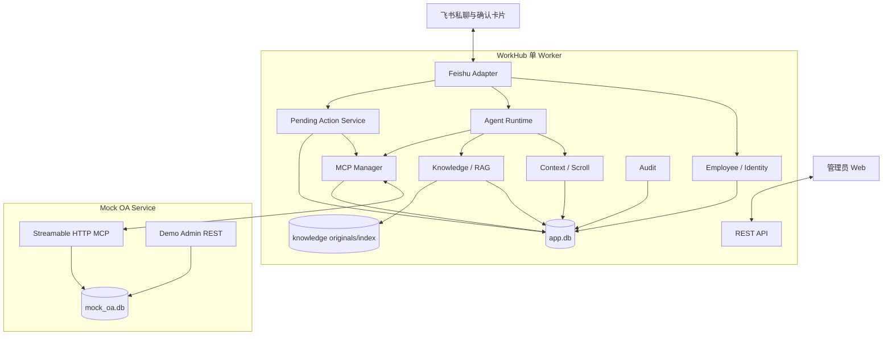
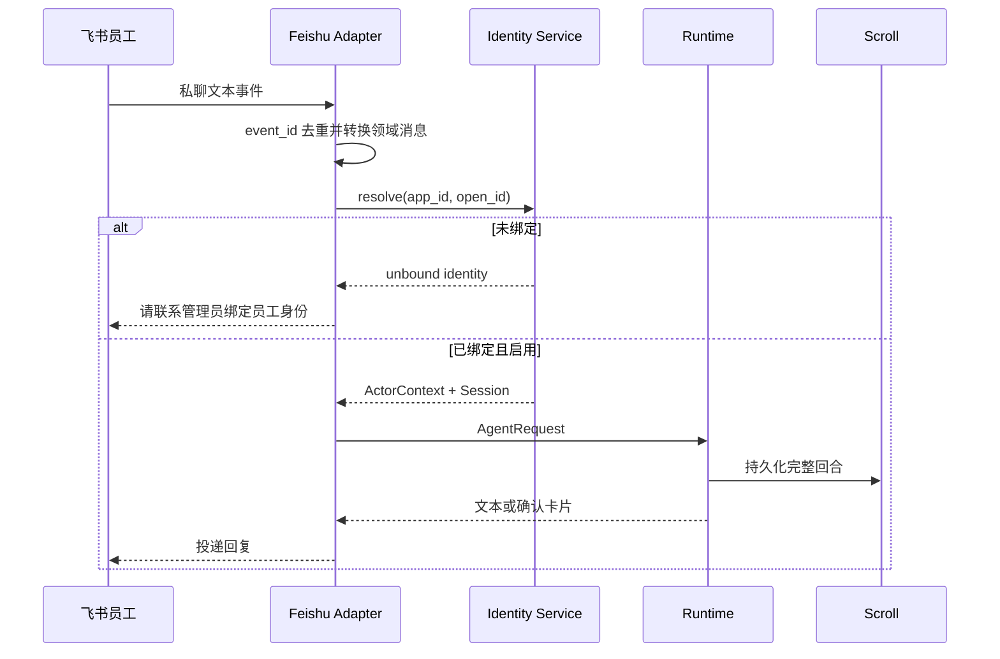
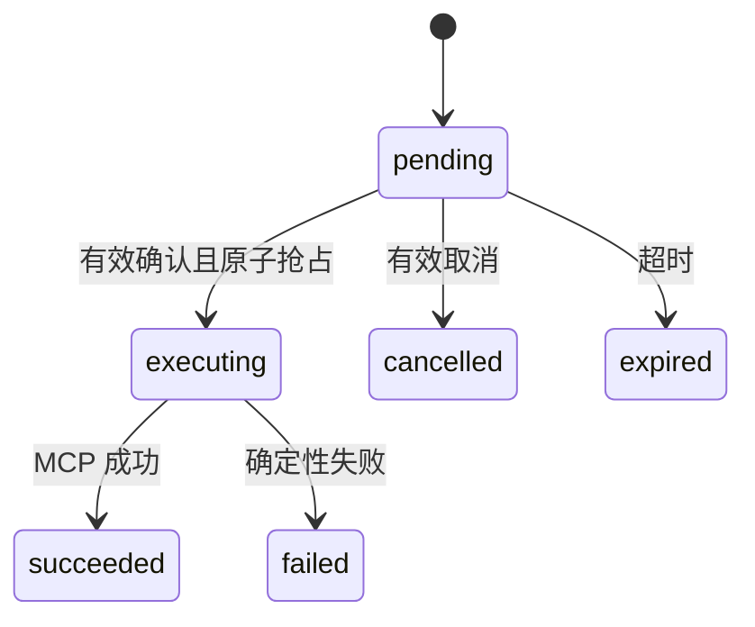
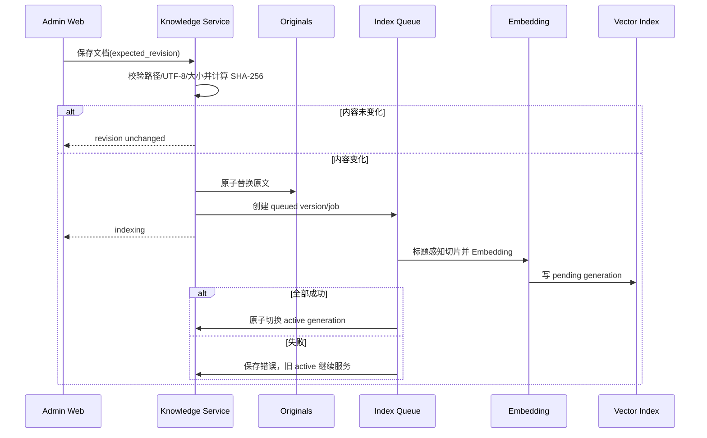

# WorkHub 技术设计

> 状态：Accepted
>
> 本文描述首版实现架构、存储和数据流。业务范围见 [proposal.md](proposal.md)，不可违背的契约见 [spec.md](spec.md)。

## 1. 技术基线与原则

WorkHub 是单企业、单飞书应用、单 Agent、多员工隔离的自托管应用。首版遵循：

- **可信身份先于推理**：只有已绑定、启用的员工可以进入 Runtime；
- **入口与内核分离**：飞书 SDK 事件先转换为领域消息；
- **主体不可由模型选择**：所有企业工具使用服务端 `ActorContext`；
- **原文与索引分离**：知识文件是真相，chunk 和向量可重建；
- **确认与业务审批分离**：WorkHub 只取得申请人确认，OA 拥有审批状态；
- **持久动作代替等待 run**：确认期间不占用模型、锁或连接；
- **单库不等于无边界**：`app.db` 内按 repository 和外键划分所有权，Mock OA 使用独立数据库；
- **首版克制**：只实现文本私聊、年假链路和最小管理端。

| 领域 | 技术选型 |
| --- | --- |
| Python | Python 3.12、FastAPI、Uvicorn、Pydantic v2 |
| 包管理 | `uv`、`pyproject.toml`、`uv.lock` |
| Agent | LangGraph、`langchain-openai` |
| 飞书 | 飞书官方 Python SDK、长连接 |
| MCP | 官方 Python SDK、Streamable HTTP |
| 数据 | SQLite WAL、aiosqlite、本地原子文件 |
| RAG | `langchain-text-splitters`、Chroma、OpenAI-compatible Embedding |
| Web | React 18、TypeScript、Vite、Ant Design |
| 观测 | 结构化日志、审计表、可选 Langfuse |
| 测试 | pytest、pytest-asyncio、Vitest、Playwright |

统一命名：产品 `WorkHub`，仓库 `workhub`，Python 包/CLI `workhub`，环境变量前缀 `WORKHUB_`，默认数据目录 `~/.workhub`。

## 2. 总体架构



飞书和 Web 是表面，Adapter/API 只处理外部协议；Runtime 编排自由文本 Agent run；Pending Action Service 编排确定性的确认回调；Mock OA 独立拥有业务余额和申请。

## 3. 模块与依赖

```text
api / channels
        ↓
runtime / confirmations
        ↓
employees / context / knowledge / mcp / providers / audit
        ↓
storage
```

| 模块 | 核心职责 | 禁止事项 |
| --- | --- | --- |
| `domain` | ID、消息、员工、动作、工具、错误契约 | I/O 和框架依赖 |
| `channels/feishu` | 长连接、事件去重、消息/卡片转换和投递 | 直接 SQL、模型推理 |
| `api` | 管理认证、验证和 DTO 转换 | 直接执行工具或业务审批 |
| `employees` | 员工、identity、绑定和 ActorContext | 信任模型提供的主体 |
| `runtime` | Prompt、Scroll、工具快照和 Agent loop | 飞书原始结构、直接 SQL |
| `context` | Session、turn、headline、Scroll、recall | 外部聊天历史和知识内容 |
| `knowledge` | 目录、原文、版本、切片、generation | 员工会话和 OA 数据 |
| `mcp` | 客户端、发现、白名单、策略和调用包装 | 保存 OA 业务真相 |
| `confirmations` | PendingAction、卡片、原子抢占和恢复 | 自由形式模型推理 |
| `providers` | Chat/Embedding 接口与配置 | 员工和渠道状态 |
| `audit` | 脱敏审计事件 | 保存密钥、token 或完整敏感参数 |
| `storage` | SQLite repository、迁移和原子文件 | API 或渠道协议 |

## 4. 飞书接入与身份生命周期

`FeishuGateway` 使用官方 SDK 建立长连接，订阅私聊消息和交互卡片事件。它负责有限重连、健康状态和关闭；事件处理不得阻塞 SDK 接收线程，需投递到应用异步循环。

消息流程：



未知 identity 的创建使用 upsert，重复事件或并发首次消息不得产生多条记录。管理员先创建员工，再从待绑定列表选择 identity 完成绑定。解绑不删除历史，不允许把旧历史迁移给另一员工。

首版只解析飞书文本消息。非文本和群聊事件记录最小诊断信息后返回不支持提示；不得下载附件。`ChannelAddress` 只用于回复路由，不参与员工或 Session 选择。

## 5. Runtime 与可信工具调用

一次 Agent run：

1. Adapter 取得当前员工执行锁并构造 `AgentRequest`；
2. Runtime 从代码加载系统规则，注入 ActorContext 的展示字段；
3. Context 构造最近完整回合和 headline 导航；
4. Knowledge 与 MCP 提供不可变工具快照；
5. LangGraph 执行模型和允许直接运行的工具；
6. `confirm` 工具不连接 MCP，而是创建 PendingAction 并生成确认卡片；
7. Context 原子完成回合并释放员工锁；
8. Adapter 投递回复，投递结果写入审计。

模型侧工具和执行侧工具分开建模：

```text
Discovered MCP schema
        ↓ remove subject fields / validate
Model ToolDescriptor
        ↓ model arguments
Invocation Wrapper + ActorContext
        ↓ inject trusted subject and idempotency
Actual MCP call
```

包装器删除或覆盖模型参数中的 `employee_id`、`employee_no`、`open_id` 等字段，并从模型 Schema 隐藏 `idempotency_key`。Mock OA 的传输约定包含可信主体元数据；执行 PendingAction 时包装器再注入服务端生成的幂等键。对不支持该约定的 MCP 客户端，主体相关工具不得启用。

系统 Prompt 固定包含：只服务当前员工、事实必须来自工具或当前上下文、制度回答引用来源、日期歧义必须追问、业务写入必须确认、不得声称完成未成功的调用。首版不提供可编辑 Persona 页面。

## 6. Context / Scroll 设计

不再为用户创建目录或独立数据库。`app.db` 中的核心表：

```text
agent_sessions(id, employee_id UNIQUE, next_seq, created_at, updated_at)
session_turns(id, session_id, employee_id, kind, seq_lo, seq_hi,
              headline, status, created_at, completed_at)
session_events(id, turn_id, session_id, employee_id, seq, event_type,
               text, tool_call_id, payload_json, created_at)
```

所有 repository 方法从 `ActorContext` 接收 employee/session，SQL 同时包含两者；不得提供只按任意 session ID 读取的 Agent 接口。`payload_json` 只保存脱敏结构化数据。

`ScrollBuilder` 按完整 turn 计算 token：优先保留当前 turn，再从新到旧装入已完成 turn。被驱逐内容用压缩索引替换：最近 20 个旧 turn 显示 seq 范围与 headline，更早内容合并范围。headline 可由主响应结构化输出，失败时使用用户文本首行截断。

`RecallService` 使用 `(employee_id, session_id, seq)` 复合索引读取原文；搜索优先 FTS5，不可用时降级为参数化 LIKE。确认回合的 `kind=confirmation`，与创建动作的普通回合通过 `pending_action_id` 关联，但不修改已经完成的旧回合。

## 7. Pending Action 设计

### 7.1 创建

当 Agent 选择 `confirm` 工具时，Runtime：

1. 用工具 Schema 规范化并验证模型参数；
2. 根据 ActorContext 和工具参数生成确定性摘要；
3. 生成 action ID、随机 token、参数哈希和幂等键；
4. 在同一事务中写入 `pending_actions` 和 Scroll 创建事件；
5. 只把原始 token 放入飞书卡片，数据库保存 token 哈希；
6. 完成当前回合，不调用 MCP；如果卡片投递失败，则把动作转为 cancelled 并记录失败。

`pending_actions` 建议字段：

```text
id, token_hash, employee_id, session_id, channel_identity_id,
conversation_id, mcp_client_key, tool_name, canonical_args_json,
args_hash, confirmation_summary_json, idempotency_key UNIQUE,
status, result_summary_json, error_code, expires_at,
created_at, started_at, completed_at
```

### 7.2 确认与取消



回调先验证飞书身份、会话地址、token 哈希、有效期和动作状态。确认使用条件更新 `WHERE status='pending'` 抢占；取消同理。未抢占者读取已有状态并幂等更新卡片。

执行路径不启动 LLM：创建 confirmation turn，重新发现工具并检查策略，调用 MCP，保存结果，完成 turn，更新原卡片并发送文本结果。执行失败为终态；员工需要重新发起才能生成新动作。

服务启动时扫描：过期 pending 转 expired；未过期 pending 保持有效；executing 使用幂等键向 Mock OA 重试同一提交，得到已有申请后完成 succeeded，无法确定时保持失败并记录人工诊断，不生成第二张申请。

## 8. MCP Manager

MCPManager 是进程级异步组件，只维护 Streamable HTTP 客户端：

- 启动时并发连接启用客户端，单客户端失败隔离；
- 配置变更只关闭和重建目标客户端；
- 工具发现缓存原始名称、说明和输入 Schema；
- 模型工具名使用 `mcp__<client_key>__<sanitized_tool_name>`，名称冲突拒绝注册；
- `tool_allowlist` 决定暴露，`tool_effect` 决定 `allow/confirm/deny`；
- 新客户端和新工具默认 `deny`；
- 运行快照持有连接句柄、Schema 和策略版本，完成后释放。

Mock OA 客户端默认配置三项工具。真实密钥和 headers 加密不在首版，但必须限制 `app.db` 权限、API 脱敏并禁止日志输出。

## 9. Knowledge 目录与索引

### 9.1 存储模型

```text
<WORKHUB_DATA_DIR>/knowledge/
├── originals/
│   ├── policies/
│   │   └── leave/
│   │       └── 年假管理制度.md
│   └── guides/
├── staging/
└── index/
```

`knowledge_nodes` 表表达树：稳定 UUID、parent ID、类型、名称和相对路径。文档另有 `knowledge_document_versions`、`knowledge_index_jobs`、`knowledge_generations` 和 chunk 元数据。目录移动在事务内更新整棵子树的相对路径；文件系统操作使用 staging 与原子 rename，数据库和文件失败时执行明确补偿并标记 reconciliation_required。

管理端/API 是唯一受支持写入口。应用启动的 Reconciler 比较节点、原文哈希、active generation 和索引目录：缺文件、孤儿文件、哈希不一致或索引缺失均进入结构化异常状态和修复队列。

### 9.2 保存与索引流程



单并发消费者运行于 WorkHub 进程生命周期内，但不暴露为通用任务系统。移动/重命名在内容哈希不变时只更新数据库和 chunk 展示路径。删除清理原文、元数据和各 generation。

Agent 的搜索结果只返回有限片段和定位；需要完整依据时调用按行读取。回答制度问题时 Prompt 要求引用“文档路径 + 版本 + 行号”。

## 10. Mock OA 服务

Mock OA 是仓库内独立 Python 包/服务和独立容器，不导入 WorkHub 应用模块，只共享版本化 MCP 契约和测试 fixtures。

```text
Mock OA
├── Streamable HTTP MCP
│   ├── query_leave_balance
│   ├── submit_leave_request
│   └── query_leave_request_status
├── Demo Admin REST
│   └── PATCH /api/v1/leave-requests/{request_id}/status
└── mock_oa.db
```

余额和申请事务在 Mock OA 内完成。`submit_leave_request` 先按 `(employee_id, idempotency_key)` 查询，再校验并创建；重试返回原记录。申请创建为 `pending_approval`。Demo Admin REST 只接受 `approved/rejected`，使用独立管理 token，不注册到 MCP，也不出现在 Agent Prompt。

## 11. 管理端与 API

管理端保持工作型、紧凑的信息架构：

```text
概览
员工                 # 员工详情内绑定待认领飞书身份
知识库               # 左侧目录树，右侧编辑器和索引状态
MCP                  # 客户端、发现工具、白名单和策略
审计                 # 按员工、事件、工具、动作和结果筛选
设置
├── 模型
└── 飞书状态          # 只读连接状态与待绑定身份入口
```

员工页不展示任意用户文件；知识页保存使用 revision 防止覆盖；MCP 页默认把新工具显示为 deny；审计页展示脱敏摘要。所有写 API 经过管理员 Session、CSRF/同源检查、参数验证和 repository，不直接执行 SQL。

## 12. 配置、数据库与部署

运行时配置由 `model_settings`、`feishu_settings` 和 `runtime_settings` 保存。启动参数由 Compose 固定注入；管理员首次引导凭据仍由环境变量提供。管理 API 保存配置后，模型工厂读取新版本，运行对象更新超时参数，Feishu Gateway 使用新凭据优雅重建。详细约定见 [runtime-configuration.md](runtime-configuration.md)。

`app.db` 是 WorkHub 状态真相来源，至少包含：

```text
schema_migrations, admin_users, admin_sessions,
employees, channel_identities, agent_sessions,
session_turns, session_events, processed_channel_events,
pending_actions, model_settings, feishu_settings,
mcp_clients, mcp_tools, mcp_tool_settings,
knowledge_nodes, knowledge_document_versions,
knowledge_index_jobs, knowledge_generations,
audit_events
```

表多不是拆库条件；首版写入规模和单 Worker 模式适合 SQLite。所有连接启用 WAL、foreign keys、busy timeout，事务保持短小，常用隔离键建立复合索引。未来多副本时通过 repository 边界迁移 PostgreSQL，不在首版双写。

Docker Compose 至少包含：

```text
workhub       # FastAPI、飞书长连接、Runtime、索引消费者、静态管理端
mock-oa       # MCP 与 Demo Admin REST
```

两者使用独立数据卷；Mock OA 只通过网络契约访问。Chroma 作为 WorkHub 本地持久索引，不新增独立向量服务。

## 13. 安全、审计与故障退化

- 管理员密码使用强哈希，Session cookie 使用 HttpOnly/SameSite；
- 飞书凭据、模型密钥、MCP headers 和 Mock OA 管理 token 不回显；
- 事件、确认、MCP 和知识变更建立结构化审计，参数按工具定义脱敏；
- 飞书断线时健康状态降级，管理 Web 和知识管理仍可用；
- 单个 MCP 故障不影响制度问答；Embedding 故障保留旧索引；
- Langfuse 未配置或失败时退化为本地日志，不影响业务；
- 禁用员工、身份解绑、策略 deny 和确认校验均 fail closed。

## 14. 测试策略

- unit：身份解析、日期与 Schema 校验、Scroll、headline、策略、动作状态机、切片和哈希；
- contract：FeishuMessage、ActorContext、MCP 工具、REST DTO 和结构化错误；
- integration：SQLite 约束、飞书事件去重、索引 generation、MCP 调用、确认重启恢复和 Mock OA 幂等；
- e2e：两名员工隔离、知识问答、年假余额、确认卡片、提交、模拟审批状态更新和进度查询；
- security：跨员工 recall、跨用户卡片、重放、过期、路径逃逸、密钥回显和日志快照。
